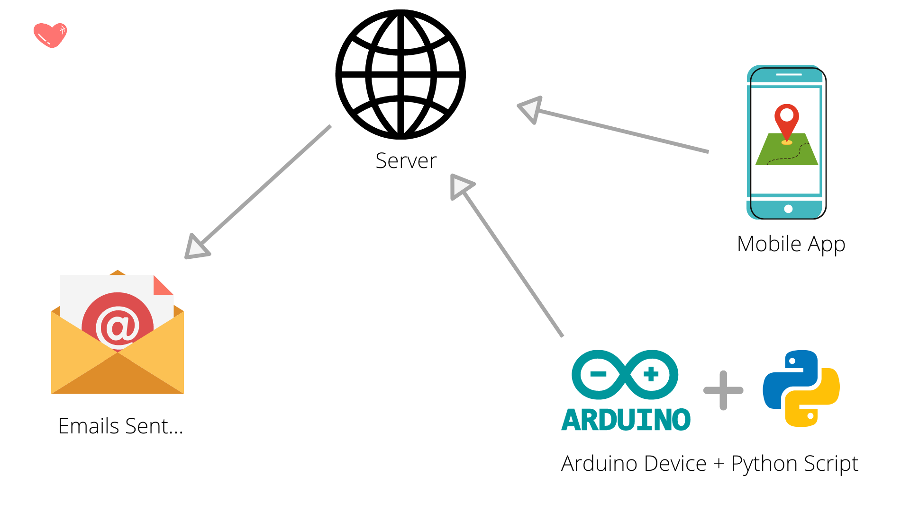
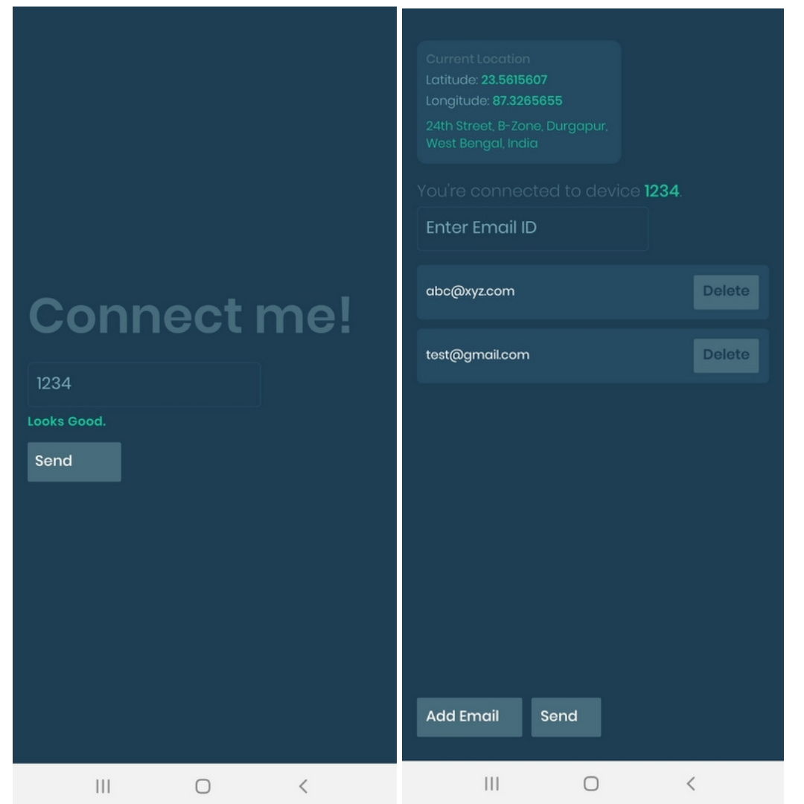
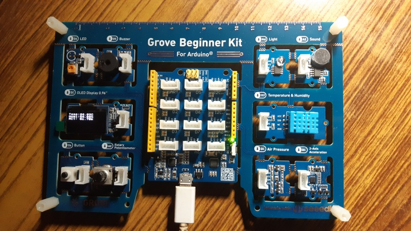
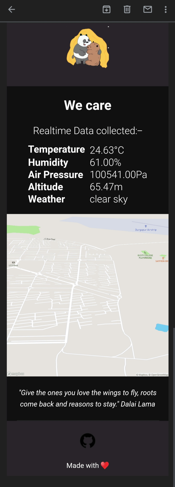



<h1>WeCare</h1>

## Built using

- **Hardware**
	- Arduino UNO
	- Temperature and Humidity Sensor (DTH11)
	- Air Pressure Sensor (BMP280)
	- OLED Display
	- PySerial module to connect Arduino with Python program.
- **Mobile App**
	- React Native
	- Expo SDK
	- Expo Location API
- **Server**
	- Node and Express
- **Services Used**
	- Firebase Cloud Storage: to store the details of the user temporarily.
	- Sendgrid Mailing Service: to send the mails to the registered email addresses.
	- OpenWeatherMap API: to get the weather forecast.
	- Mapbox API: to get the static map images.

## System Overview

## Screenshots

### Mobile Application view

Link to the APK: https://expo.io/artifacts/ca00e6ee-4380-4fcc-bdd7-de030db653ca

### Arduino

### Final Email view

## Demo

## Inspiration

We visit different places, maybe for trekking, for holidays, or some important meetings and events, and back in our home, our families and friends often remain worried. It is not always possible to reach out to them every few minutes to let them know about our location and our surrounding situation.

So, to tackle this issue we came up with a solution, that will collect your **geographical location**, and other environmental details like **temperature, humidity, air pressure** of your surroundings, and **send an e-mail** to your friends and families every few minutes automatically.

## What it does
We have a hardware device, that senses the air pressure, humidity, and temperature which then sends requests to a central server. We also have a mobile application that tracks the geographical coordinates (latitude and longitude) and also sends the information to the same server.

The server upon receiving all the data, verifies them, processes it, and collects other information like weather forecast of the location (based on the coordinates), triggers the email service to send the mail to the registered addresses.

As a user, all you need to do is enable GPS in your mobile device, enter the unique device id, add emails to whom you want the details to be sent, and finally press the send button.

*That’s it !!! Your closed ones won’t be worried anymore.*

## How we built it
We are using **Arduino UNO** to collect the details using the:

1. Temperature and Humidity Sensor( DHT11 ).
2. Air pressure sensor (BMP280).

And also displaying those values in an OLED display component.

The Arduino is then connected to a **Python** program using **Pyserial** module to forward the collected information. The Python script then makes a **POST request** to the Node based server along with all the details. This process keeps repeating at a fixed interval.

The other component is the mobile application, which is built using the **React Native framework** and **Expo SDK**. The app is using the **Expo Location API** to get the coordinates of the userm, sends this data to the server periodically along with other information like email addresses and device id.

The server is built with **Node Js** and **Express** and is deployed to **Heroku**. It receives the incoming information from the device and mobile app. We are using **Firebase Cloud Storage** to temporarily store the data. Both the device and the mobile application is bound by a unique Id, so that the server can recognize them. As soon as the ids match the server sends the emails to the registered addresses.

We are using the **Sendgrid mailing service** for that. In the email we have
1.  Temperature, Humidity, Air Pressure, Altitude datas.
2.  A static image of the map based on the coordinates using the **Mapbox API**.
3.  Weather forecast of the location using the **OpenWeatherMap API**.
4.  A link to the exact location in the **Google Maps**.

>Once the email is sent the record in the firebase gets deleted automatically.

## Challenges we ran into

1.  This was the first hackathon for most of our team members, so lack of familiarity was a major challenge.
2.  We have never integrated Arduino with any project, so there was a learning curve we had to overcome. This is also the first time we implemented Firebase Cloud Storage.
3.  Synchronizing the data from the device and Arduino was something we were stuck for a long time.
4.  Since this was completely online, coordinating and discussing ideas and views among teammates was another challenge.

## Accomplishments that we're proud of
1. We're proud that we identified a genuine and a very common issue, and was able to come up with an efficient solution.
2.  Since this was the first hackathon for many of us, and the fact that we were able to make a minimum viable product within 48 hours, is also something we are really proud of.
3.  This is also the first time we have combined Back-end development, Hardware, and Mobile App development together and we were successful in that.

## What we learned

Since this was our first hackathon, it had been a great learning experience for all of us.

1.  We learned how to collect data from the various sensors using Arduino. Also learned how to connect the Arduino with Python Pyserial module to further communicate with the webserver.
2.  Fetching a mobile’s location along with other inputs and sending it to the web server was something new for us.
3.  We also didn’t have much idea how to integrate the various components with the web server and using a third party mailing service to send emails. So this was also a new learning for us.
4.  Most importantly, we learnt about this amazing MLH community, and the practices to be followed in a hackathon. This experience will surely guide us in our future undertakings and encourage us to participate in upcoming hackathons and events.

## What's next for WeCare

We hope to expand the idea of WeCare in the following ways:-

1.  Make the device independent by integrating something like Raspberry Pi that will communicate automatically with the server.
2.  We can also add a GPS tracking sensor with the device itself that will track the Geo Coordinates of the user.
3.  Have a user-end dashboard, to choose which data the user wants to send. This will add more flexibility to the application.
4.  Improve the security of the APIs and device by implementing point-to-point encryption.
5.  Devise an ML model to predict future information about weather from present and historical data.

## Team: WeCare

<table>
  <tr>
    <td align="center"><a href="https://arnabsen.rocks/"> <b>Arnab Sen</b></a> <a href="https://github.com/arnabsen1729/WeCare/commits?author=arnabsen1729" title="Documentation">📖</a></td>
    <td align="center"><a href="http://www.linkedin.com/in/hrahul2605"> <b>Rahul Halder</b></a> <a href="https://github.com/arnabsen1729/WeCare/commits?author=hrahul2605" title="Documentation">📖</a></td>
    <td align="center"><a href="https://github.com/berakrishnendu36"> <b>Krishnendu Bera</b></a> <a href="https://github.com/arnabsen1729/WeCare/commits?author=berakrishnendu36" title="Documentation">📖</a></td>
    <td align="center"><a href="https://github.com/Rajdeep-G"> <b>Rajdeep Ghosh</b></a> <a href="https://github.com/arnabsen1729/WeCare/commits?author=Rajdeep-G" title="Documentation">📖</a></td>
  </tr>
</table>
